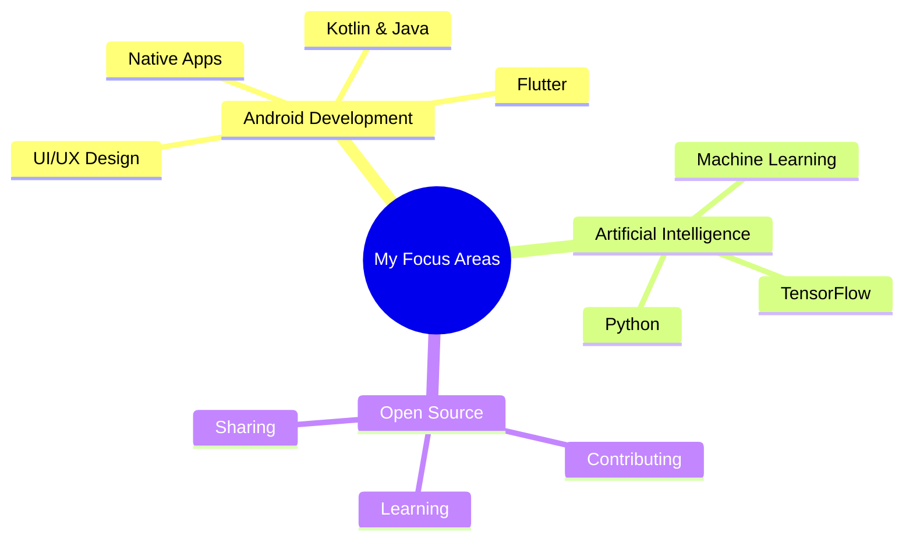
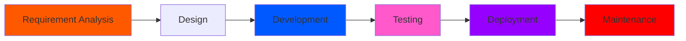

<div align="center">
  
</div>

<div align="center"> 
  
</div>

<div align="center">
  
</div>

<div align="center">
  
 <a href="https://komarev.com/ghpvc/?username=abhishek-maurya576">
    
  </a>
  
  
</div>

---

## 👋 Introduction 

I'm Abhishek Maurya, a passionate Android and Flutter developer currently pursuing a BCA at the University of Allahabad. I specialize in building cross-platform mobile applications with Flutter and native Android apps using Java/Kotlin, while also exploring AI/ML with Python and TensorFlow. With a keen eye for UI/UX design and a commitment to clean code, I transform innovative ideas into user-friendly applications that solve real-world problems.

---

## 🌐 Portfolio & Projects
[](https://abhishek-maurya576.github.io/portfolio/)
---

## 🚀 What I Do 

- 📱 **Android App Development** with Java/Kotlin - native mobile applications
- 📱 **Flutter Development** - cross-platform apps for iOS, Android, and Web
- 🤖 **AI/ML Integrations** using Python/TensorFlow for smart app features
- 🎨 **UI/UX Design** with modern Android Material Design and Flutter principles
- 🌐 **Web Development** using React for responsive interfaces
- 📂 **Version Control** with Git & GitHub for collaborative development and open source

---

<div style="background: linear-gradient(45deg, #12c2e9, #c471ed, #f64f59); padding: 20px; border-radius: 10px; margin: 20px 0;">


## 💻 Tech Stack & Tools | Mobile & Web Development
<p align="center">
  
</p>

<div align="center" style="transform-style: preserve-3d; perspective: 1000px;">
  <table align="center" style="transform: rotateX(10deg); box-shadow: 0 10px 30px rgba(0,0,0,0.3); border-radius: 15px; background: rgba(255,255,255,0.1); backdrop-filter: blur(10px);">
    <tr style="transition: all 0.3s ease;">
      <td align="center" width="96" style="padding: 20px; transition: transform 0.3s ease;">
        <div style="transform-style: preserve-3d; transition: transform 0.3s ease;">
          
          <br><span style="font-weight: bold; color: #ffffff; text-shadow: 2px 2px 4px rgba(0,0,0,0.3);">Java</span>
        </div>
      </td>
      <td align="center" width="96" style="padding: 20px;">
        <div style="transform-style: preserve-3d;">
          
          <br><span style="font-weight: bold; color: #ffffff; text-shadow: 2px 2px 4px rgba(0,0,0,0.3);">Python</span>
        </div>
      </td>
      <td align="center" width="96" style="padding: 20px;">
        <div style="transform-style: preserve-3d;">
          
          <br><span style="font-weight: bold; color: #ffffff; text-shadow: 2px 2px 4px rgba(0,0,0,0.3);">GitHub</span>
        </div>
      </td>
      <td align="center" width="96" style="padding: 20px;">
        <div style="transform-style: preserve-3d;">
          
          <br><span style="font-weight: bold; color: #ffffff; text-shadow: 2px 2px 4px rgba(0,0,0,0.3);">MySQL</span>
        </div>
      </td>
      <td align="center" width="96" style="padding: 20px;">
        <div style="transform-style: preserve-3d;">
          
          <br><span style="font-weight: bold; color: #ffffff; text-shadow: 2px 2px 4px rgba(0,0,0,0.3);">Firebase</span>
        </div>
      </td>
    </tr>
  </table>
</div>

</div>

## :man_technologist: About Me 
> - 🌱 I'm currently learning **Flutter, Java, Kotlin, and advanced Android Development**
> - 🔭 Working on exciting **cross-platform mobile applications** and exploring AI integration
> - 🤖 Implementing **machine learning models** into mobile apps - it's my new passion in tech!
> - 💬 Ask me about **Java, Kotlin, Flutter, Dart, Android, Firebase, or AI integration**
> - ✨ Passionate about **Mobile App Development** and **AI/ML Integration**
> - 📱 Focused on creating **seamless user experiences** across multiple platforms
> - ⚡ Fun fact: I think I am good at sleeping 😴

## 💻 Tech Stack | Mobile & Web Development Skills
-which I have worked with or just hands-on
| Categories      | Tools & Skills
| ----------- | ----------- | 
| 👩‍💻 Languages     |        |
| 🤖 AI/ML |     |
|📚 Frameworks, Platforms and Libraries|    
| ⚡ Database   |  |
| 🖍 Design     |    
| 👩‍💻 IDE    |     
| 🎓 Education  |    
| 📱 OS         |   |
| ☁️ Hosting/Saas|   
| 📈 Version Control |    |
| 📦 CI/CD |  
## 📫 How to reach me | Contact Information

[](mailto:maurya9721@gmail.com)
[](https://github.com/abhishek-maurya576)
  
***

## 📱 My Social Handles | Connect with Me


[](https://www.linkedin.com/in/abhishekmaurya9118/)
[](https://www.instagram.com/abhishek_maurya576/)
[](https://x.com/Abhishekm576)

  


## 📊 My Github Stats | Developer Metrics

 |  Stats                                                                                                                                                                                             |  Stats                                                                                                                               |
| -----------                                                                                                                                                                                        | -----------                                                                                                                          |
|           | [](https://github.com/abhishek-maurya576)       |
|    |         |


[](https://github.com/abhishek-maurya576)
 
 
<div align="center">
  <h2>⚡ Quick Stats Dashboard</h2>
  
</div>


<div align="center">
  <table>
    <tr>
      <td align="center">
        
      </td>
    </tr>
    <tr>
      <td align="center">
        
        
      </td>
    </tr>
  </table>
</div>
<!--
**abhishek-maurya576/abhishek-maurya576** is a ✨ _special_ ✨ repository because its `README.md` (this file) appears on your GitHub profile.

Here are some ideas to get you started:

- 🔭 I'm currently working on ...
- 🌱 I'm currently learning ...
- 👯 I'm looking to collaborate on ...
- 🤔 I'm looking for help with ...
- 💬 Ask me about ...
- 📫 How to reach me: ...
- 😄 Pronouns: ...
- ⚡ Fun fact: ...
-->


<details>	
 <summary><b>GSSOC(24) Badges 🪶</b></summary><br>
<div style='display:flex; align-items:center; gap: 10px;' align='center'><a href="https://gssoc.girlscript.tech/leaderboard">

  
  
  
  
  
  
  
  
  
  
  </a>
</div>
</details>

 


</div>

<div align="center">
  <h2>🏆 GitHub Trophies</h2>
  
</div>


## 🎯 Current Focus


## 🚀 Latest Projects | Mobile App Portfolio
<div align="center">
  <table>
    <tr>
      <td align="center">
        <a href="https://github.com/abhishek-maurya576/linkzy">
          
          <br/>
          
          
        </a>
        <p><strong>Linkzy: Flutter Chat App</strong> - A modern real-time 1-on-1 chat application built with Flutter and Firebase. Features include secure messaging with PIN protection, animated UI, cross-platform support (iOS, Android, Web), and real-time notifications. <em>Keywords: Flutter, Firebase, Real-time Chat, Cross-platform, Mobile App</em></p>
      </td>
    </tr>
    <tr>
      <td align="center">
        <a href="https://github.com/abhishek-maurya576/EduReach">
          
          <br/>
          
        </a>
        <p><strong>EduReach: Android Education Platform</strong> - AI-powered educational app designed to enhance learning efficiency through interactive courses, quizzes, task management, and personalized progress tracking. <em>Keywords: Android, Education App, AI, Machine Learning, Java</em></p>
      </td>
    </tr>
    <tr>
      <td align="center">
        <a href="https://github.com/abhishek-maurya576/AiChatBot">
          
        </a>
        <p>Personal assistant application that integrates advanced AI capabilities with automated interaction features. Allows for efficient message sending, app control, and information retrieval through natural language commands.</p>
      </td>
    </tr>
    <tr>
      <td align="center">
        <a href="https://github.com/abhishek-maurya576/Snake-Game">
          
        </a>
        <p>A modern implementation of the classic Snake game for Android, built with Jetpack Compose and Kotlin. Features enhanced graphics, multiple game modes, and a retro Nokia phone UI.</p>
      </td>
    </tr>
    <tr>
      <td align="center">
        <a href="https://github.com/abhishek-maurya576/snake_game">
          
        </a>
        <p>A modern implementation of the classic Snake game with enhanced features and realistic graphics using HTML5 Canvas and JavaScript.</p>
      </td>
    </tr>
    <tr>
      <td align="center">
        <a href="https://github.com/abhishek-maurya576/Tic-Tac-Toe-AI">
          
        </a>
        <p>A modern implementation of the classic Tic Tac Toe game built with Jetpack Compose for Android, featuring an unbeatable AI opponent.</p>
      </td>
    </tr>
    <tr>
      <td align="center">
        <a href="https://github.com/abhishek-maurya576/Stop-Watch">
          
        </a>
        <p>A modern stopwatch application with a beautiful yellow theme, built using HTML, CSS, and JavaScript with a Firebase backend.</p>
      </td>
    </tr>
    <tr>
      <td align="center">
        <a href="https://github.com/abhishek-maurya576/Muzic-Player">
          
        </a>
        <p>A modern Android music player application with a clean interface for local music playback. Features media controls, background playback, and a beautiful UI.</p>
      </td>
    </tr>
    <tr>
      <td align="center">
        <a href="https://github.com/abhishek-maurya576/NetFlix-Clone">
          
        </a>
        <p>A web-based clone of the Netflix streaming platform built with HTML, CSS, and JavaScript.</p>
      </td>
    </tr>
    <tr>
      <td align="center">
        <a href="https://github.com/abhishek-maurya576/portfolio">
          
        </a>
        <p>A modern, responsive portfolio website built with React, Vite, and styled-components. Showcases projects, skills, and professional experience with a clean interface.</p>
      </td>
    </tr>
    <tr>
      <td align="center">
        <a href="https://github.com/abhishek-maurya576/AI-Text-Summarize-app">
          
        </a>
        <p>An application that uses AI to automatically summarize long texts and documents into concise, readable summaries.</p>
      </td>
    </tr>
  </table>
</div>

## 💬 Testimonials
> "Abhishek's passion for Android is insane! His contributions to Linkzy were crucial."  
> – *College Mate*

> "Always ready to help juniors and lead with example. Great mentor!"  
> – *Junior from Dev Hub*


## 🎮 When I'm Not Coding
- 📚 Reading tech blogs and documentation
- 🎮 Gaming for relaxation
- 🎧 Music & Podcasts
- 📝 Writing technical articles


### Profile Views
counting of visitors to this page started from Feb 2025


</br>


## 🛠️ Development Workflow


## 📱 Tech Stack Evolution
<div align="center">
  <table>
    <tr>
      <td align="center">
        <h3>2024</h3>
        <br/>
        <br/>
        
      </td>
      <td align="center">
        <h3>2024</h3>
        <br/>
        <br/>
        
      </td>
      <td align="center">
        <h3>2025</h3>
        <br/>
        <br/>
        
      </td>
    </tr>
  </table>
</div>

## 🎮 Fun Zone
<div align="center">
  
</div>


## 💻 Workspace Setup
<div align="center">

```text
💻 Machine: HP
⚙️ OS: Windows 11 
🚀 IDE: Android Studio, VS Code, Project IDX
🛠️ Setup: Dual Monitor
```


## 🎯 Quote I Live By
> "Code with purpose. Learn with passion. Share with heart."

<div align="center">
  <table>
    <tr>
      <td align="center">
        
        <br/>
        <div style="background: linear-gradient(45deg, #FF8008, #FFC837); padding: 15px; border-radius: 10px; margin: 10px 0; font-style: italic; font-weight: bold; color: #333;">
          <h3 style="margin: 0;">"Perfect banne ka sapna chhodo, action lo! Launch karo, seekhte jao, aur khud ko grow karta dekho."</h3>
          <p style="margin: 5px 0 0; text-align: right;">— Abhishek Maurya</p>
        </div>
      </td>
    </tr>
  </table>
</div>

---
## 🤝 Let's Connect & Collaborate

<div align="center">
  <h3>🚀 Open for Exciting Opportunities</h3>
  <p>
    
    
  </p>
  
  **Looking to collaborate on:**
  - 📱 Mobile App Development Projects
  - 🤖 AI/ML Integration Solutions  
  - 🌟 Open Source Contributions
  - 🎓 Educational Technology Projects
</div>

<div align="center">
  <table>
    <tr>
      <td align="center">
        <a href="mailto:maurya9721@gmail.com">
          
        </a>
      </td>
      <td align="center">
        <a href="https://telegram.me/Abhi_576">
          
        </a>
      </td>
      <td align="center">
        <a href="https://wa.me/9118396042">
          
        </a>
      </td>
    </tr>
  </table>
</div>

## 🌍 Global Visitor Analytics

<div align="center">
  <a href="http://s05.flagcounter.com/more/P1"></a>
</div>

<div align="center">
  
  
  <p>
    <i>⭐ If you found my profile interesting, consider giving it a star!</i><br>
    <i>🍴 Feel free to fork this template for your own use</i>
  </p>
  
  
</div>
