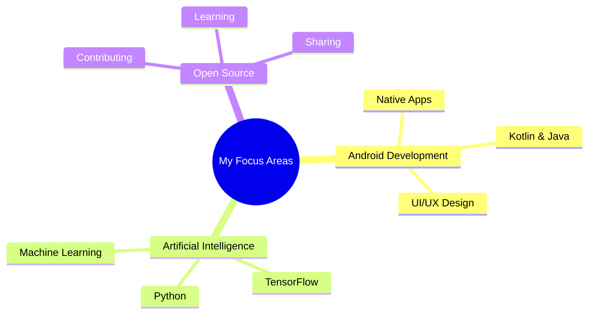
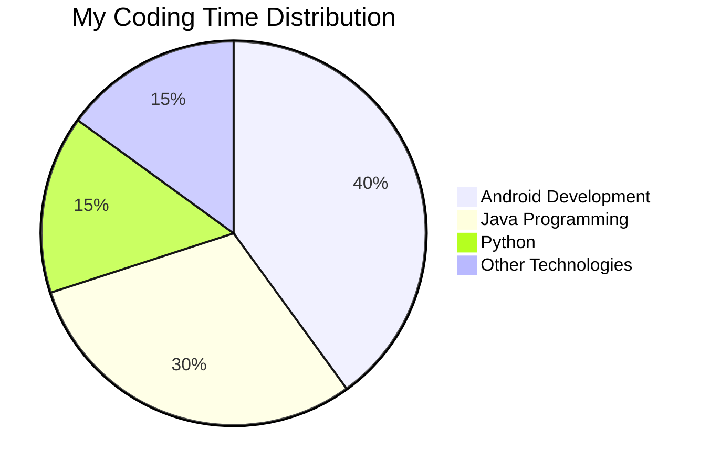
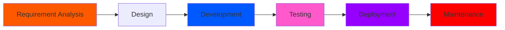
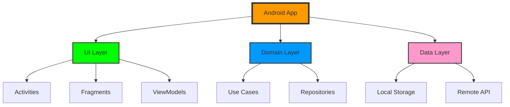
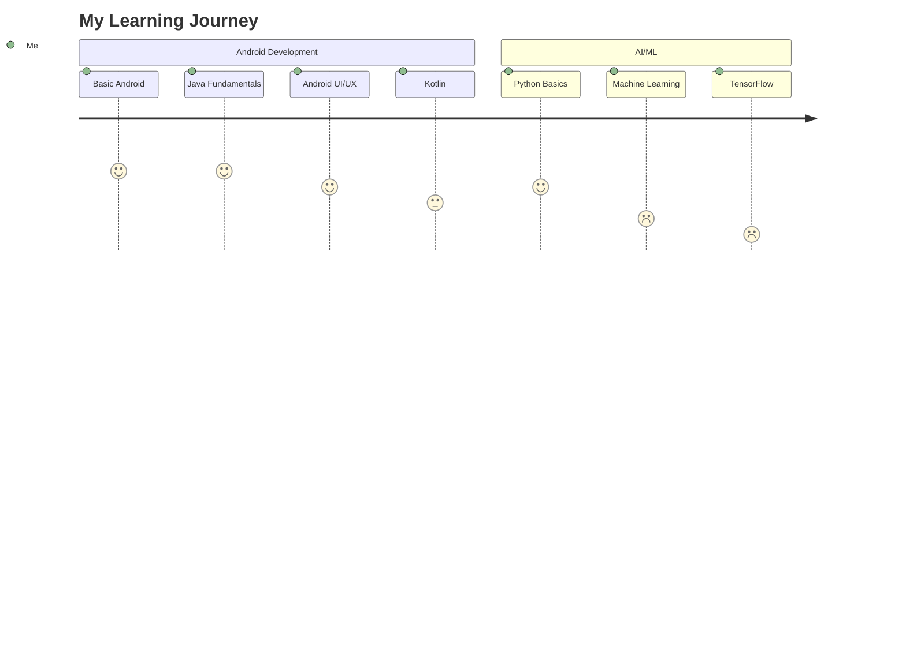
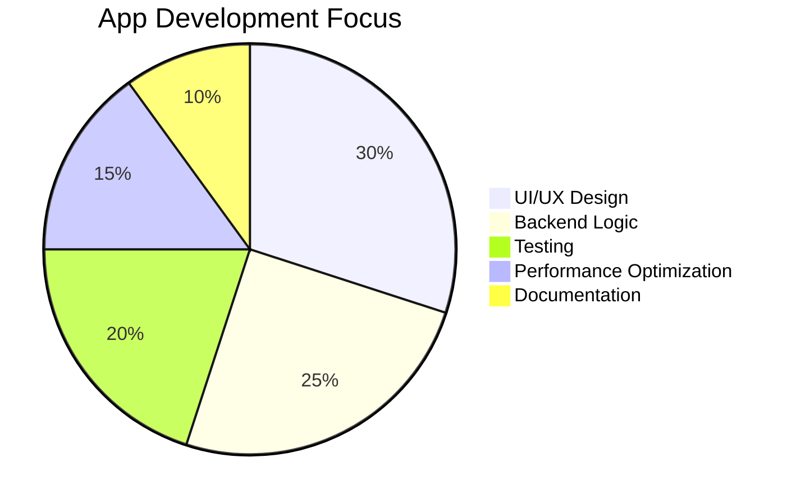
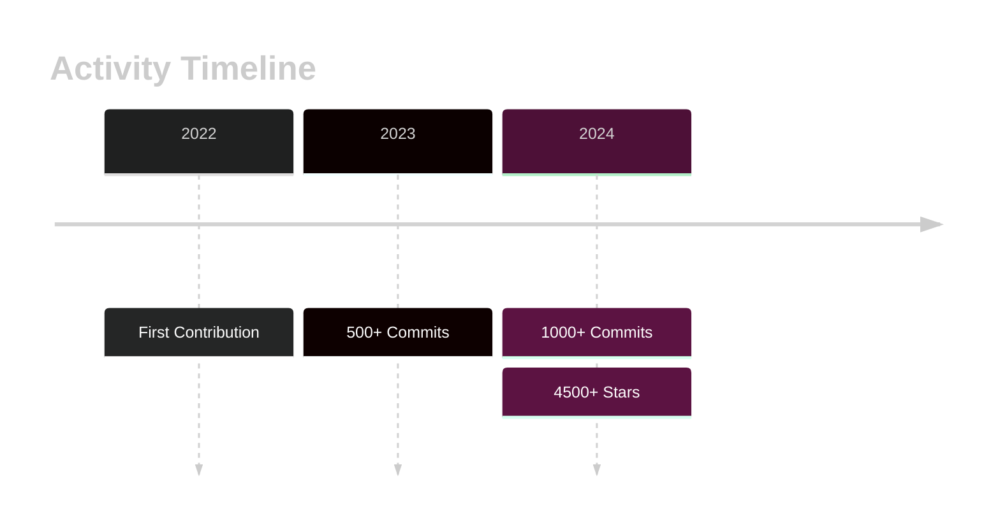
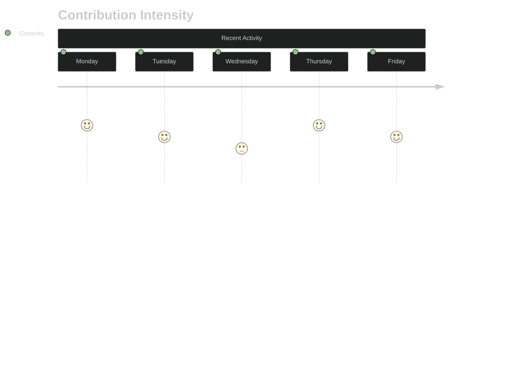

<div align="center"> 
  
</div>

<div align="center">
  
</div>

<div align="center">
  
  <a href="https://komarev.com/ghpvc/?username=abhishek-maurya576">
    
  </a>
</div>

---

## 🚀 What I Do
- 📱 Android Apps with Java/Kotlin
- 🤖 AI integrations using Python/TensorFlow
- 🎨 UI/UX design with modern Android principles
- 🌐 Web projects using HTML/CSS/JS
- 📂 Git & GitHub for version control and open source

---

<div style="background: linear-gradient(45deg, #12c2e9, #c471ed, #f64f59); padding: 20px; border-radius: 10px; margin: 20px 0;">


## 🌐 Portfolio
[](https://abhishek-maurya576.github.io/portfolio/)


## 💻 Tech Stack & Tools
<p align="center">
  
</p>

<div align="center" style="transform-style: preserve-3d; perspective: 1000px;">
  <table align="center" style="transform: rotateX(10deg); box-shadow: 0 10px 30px rgba(0,0,0,0.3); border-radius: 15px; background: rgba(255,255,255,0.1); backdrop-filter: blur(10px);">
    <tr style="transition: all 0.3s ease;">
      <td align="center" width="96" style="padding: 20px; transition: transform 0.3s ease;">
        <div style="transform-style: preserve-3d; transition: transform 0.3s ease;">
          
          <br><span style="font-weight: bold; color: #ffffff; text-shadow: 2px 2px 4px rgba(0,0,0,0.3);">Java</span>
        </div>
      </td>
      <td align="center" width="96" style="padding: 20px;">
        <div style="transform-style: preserve-3d;">
          
          <br><span style="font-weight: bold; color: #ffffff; text-shadow: 2px 2px 4px rgba(0,0,0,0.3);">Python</span>
        </div>
      </td>
      <td align="center" width="96" style="padding: 20px;">
        <div style="transform-style: preserve-3d;">
          
          <br><span style="font-weight: bold; color: #ffffff; text-shadow: 2px 2px 4px rgba(0,0,0,0.3);">GitHub</span>
        </div>
      </td>
      <td align="center" width="96" style="padding: 20px;">
        <div style="transform-style: preserve-3d;">
          
          <br><span style="font-weight: bold; color: #ffffff; text-shadow: 2px 2px 4px rgba(0,0,0,0.3);">MySQL</span>
        </div>
      </td>
      <td align="center" width="96" style="padding: 20px;">
        <div style="transform-style: preserve-3d;">
          
          <br><span style="font-weight: bold; color: #ffffff; text-shadow: 2px 2px 4px rgba(0,0,0,0.3);">Firebase</span>
        </div>
      </td>
    </tr>
  </table>
</div>

</div>

## :man_technologist: About Me
> - 🌱 I'm currently learning Java, Python, and Android Development
> - 🔭 Working on exciting Android projects and exploring AI
> - 🤖 Dabbling with AI - it's my new tiny companion in tech!
> - 💬 Ask me about Java, Python, Android, or AI
> - ✨ Passionate about **Android Development** and **AI Integration**
> - ⚡ Fun fact: I think I am good at sleeping 😴

## 💻 Tech Stack 
-which I have worked with or just hands-on
| Categories      | Tools & Skills
| ----------- | ----------- | 
| 👩‍💻 Languages     |       |
| 🤖 AI/ML |   |
| ⚡ Database   |  |
| 🖍 Design     | 
| 👩‍💻 IDE    |  
|📚 Frameworks, Platforms and Libraries|  
| 🎓 Education  |   
| 📱 OS         |   |
| ☁️ Hosting/Saas|   
| 📈 Version Control |    |
| 📦 CI/CD |  
## 📫 How to reach me

[](mailto:maurya9721@gmail.com)

  
***

## 📱 My Social Handles


[](https://www.linkedin.com/in/abhishekmaurya9118/)
[](https://www.instagram.com/abhishek_maurya576/)
[](https://x.com/Abhishekm576)

  


## 📊 My Github Stats 

 |  Stats                                                                                                                                                                                             |  Stats                                                                                                                               |
| -----------                                                                                                                                                                                        | -----------                                                                                                                          |
|           |        |
|    |         |


[](https://github.com/abhishek-maurya576)

  **Visitor Count**
 
 
 
 
# 🐍 My Contributions Snake Eating My Graph

<div align="center">
  <picture>
    <source
      media="(prefers-color-scheme: dark)"
      srcset="https://raw.githubusercontent.com/abhishek-maurya576/abhishek-maurya576/output/github-snake-dark.svg"
    />
    <source
      media="(prefers-color-scheme: light)"
      srcset="https://raw.githubusercontent.com/abhishek-maurya576/abhishek-maurya576/output/github-snake.svg"
    />
    
  </picture>

  <br/>
  <em>🎮 Watch the snake eat my contributions! 🐍</em>
</div>

<!--
**abhishek-maurya576/abhishek-maurya576** is a ✨ _special_ ✨ repository because its `README.md` (this file) appears on your GitHub profile.

Here are some ideas to get you started:

- 🔭 I'm currently working on ...
- 🌱 I'm currently learning ...
- 👯 I'm looking to collaborate on ...
- 🤔 I'm looking for help with ...
- 💬 Ask me about ...
- 📫 How to reach me: ...
- 😄 Pronouns: ...
- ⚡ Fun fact: ...
-->


<details>	
 <summary><b>GSSOC(24) Badges 🪶</b></summary><br>
<div style='display:flex; align-items:center; gap: 10px;' align='center'><a href="https://gssoc.girlscript.tech/leaderboard">

  
  
  
  
  
  
  
  
  
  
  </a>
</div>
</details>

 

<div align="center">
  
</div>

<div align="center">
  <h2>🏆 GitHub Trophies</h2>
  
</div>

<div align="center">
  <h2>⚡ Activity Graph</h2>
  
</div>

<div align="center">
  <h2>🎯 Skills Progress</h2>
  
  ```text
  Java          ███████████████████░░   90%
  Android       ██████████████████░░░   85%
  Python        ████████████████░░░░░   75%
  MySQL         ███████████████░░░░░░   70%
  Firebase      ███████████████░░░░░░   70%
  Git/GitHub    ████████████████░░░░░   75%
  AI/ML         ██████████░░░░░░░░░░   50%
  ```
</div>

<div align="center">
  
  <h3>Thanks for visiting! Here's a coding joke for you:</h3>
  
</div>

<div align="center">
  
</div>

## 🌐 Portfolio
[](https://abhishek-maurya576.github.io/portfolio/)

## 🎯 Current Focus


## 🚀 Latest Projects
<div align="center">
  <table>
    <tr>
      <td align="center">
        <a href="https://github.com/abhishek-maurya576/EduReach">
          
        </a>
        <p>AI-powered educational app designed to enhance learning efficiency through interactive courses, quizzes, task management, and personalized progress tracking.</p>
      </td>
    </tr>
    <tr>
      <td align="center">
        <a href="https://github.com/abhishek-maurya576/AiChatBot">
          
        </a>
        <p>Personal assistant application that integrates advanced AI capabilities with automated interaction features. Allows for efficient message sending, app control, and information retrieval through natural language commands.</p>
      </td>
    </tr>
    <tr>
      <td align="center">
        <a href="https://github.com/abhishek-maurya576/Snake-Game">
          
        </a>
        <p>A modern implementation of the classic Snake game for Android, built with Jetpack Compose and Kotlin. Features enhanced graphics, multiple game modes, and a retro Nokia phone UI.</p>
      </td>
    </tr>
    <tr>
      <td align="center">
        <a href="https://github.com/abhishek-maurya576/snake_game">
          
        </a>
        <p>A modern implementation of the classic Snake game with enhanced features and realistic graphics using HTML5 Canvas and JavaScript.</p>
      </td>
    </tr>
    <tr>
      <td align="center">
        <a href="https://github.com/abhishek-maurya576/Tic-Tac-Toe-AI">
          
        </a>
        <p>A modern implementation of the classic Tic Tac Toe game built with Jetpack Compose for Android, featuring an unbeatable AI opponent.</p>
      </td>
    </tr>
    <tr>
      <td align="center">
        <a href="https://github.com/abhishek-maurya576/Stop-Watch">
          
        </a>
        <p>A modern stopwatch application with a beautiful yellow theme, built using HTML, CSS, and JavaScript with a Firebase backend.</p>
      </td>
    </tr>
    <tr>
      <td align="center">
        <a href="https://github.com/abhishek-maurya576/Muzic-Player">
          
        </a>
        <p>A modern Android music player application with a clean interface for local music playback. Features media controls, background playback, and a beautiful UI.</p>
      </td>
    </tr>
    <tr>
      <td align="center">
        <a href="https://github.com/abhishek-maurya576/NetFlix-Clone">
          
        </a>
        <p>A web-based clone of the Netflix streaming platform built with HTML, CSS, and JavaScript.</p>
      </td>
    </tr>
    <tr>
      <td align="center">
        <a href="https://github.com/abhishek-maurya576/portfolio">
          
        </a>
        <p>A modern, responsive portfolio website built with React, Vite, and styled-components. Showcases projects, skills, and professional experience with a clean interface.</p>
      </td>
    </tr>
    <tr>
      <td align="center">
        <a href="https://github.com/abhishek-maurya576/AI-Text-Summarize-app">
          
        </a>
        <p>An application that uses AI to automatically summarize long texts and documents into concise, readable summaries.</p>
      </td>
    </tr>
  </table>
</div>

## 💬 Testimonials
> "Abhishek's passion for Android is insane! His contributions to Linkzy were crucial."  
> – *College Mate*

> "Always ready to help juniors and lead with example. Great mentor!"  
> – *Junior from Dev Hub*

## 🏃‍♂️ My Coding Journey
<div align="center">
  <table>
    <tr>
      <td>
        
      </td>
      <td>
        
      </td>
    </tr>
  </table>
</div>

## 🎨 Featured Projects
<div align="center">
  <a href="https://github.com/abhishek-maurya576/portfolio">
    
  </a>
</div>

## 🌟 Skills Progress
<div align="center">

```text
Android Dev    [██████████░░░░░░░░░░]  50%
Java          [████████████░░░░░░░░]  60%
Kotlin        [██████░░░░░░░░░░░░░]  30%
Python        [████████░░░░░░░░░░░]  40%
Firebase      [███████░░░░░░░░░░░░]  35%
Git/GitHub    [█████████░░░░░░░░░░]  45%
```

</div>

## 🎯 Current Goals
<div align="center">
  <table>
    <tr>
      <td align="center">
        
      </td>
      <td align="center">
        
      </td>
      <td align="center">
        
      </td>
    </tr>
  </table>
</div>


## 📊 Contribution Graph
<div align="center">
  
</div>

## 🏆 Hackathons & Competitions
<div align="center">
  <table>
    <tr>
      <td align="center">
        
      </td>
      <td align="center">
        
      </td>
      <td align="center">
        
      </td>
    </tr>
  </table>
</div>

## 🌱 Learning Journey
<div align="center">
  <table>
    <tr>
      <td align="center">
        
      </td>
      <td align="center">
        
      </td>
    </tr>
    <tr>
      <td align="center">
        
      </td>
      <td align="center">
        
      </td>
    </tr>
    <tr>
      <td align="center">
        
      </td>
      <td align="center">
        
      </td>
    </tr>
  </table>
</div>

## 🎵 Coding to the Beat
<div align="center">
  
</div>

## 🤝 Open for Collaboration
- 🚀 Looking to collaborate on Android Development projects
- 💡 Interested in AI/ML integrations
- 🌟 Open to mentoring and being mentored
- 🎯 Seeking opportunities in open source

## 🎮 When I'm Not Coding
- 📚 Reading tech blogs and documentation
- 🎮 Gaming for relaxation
- 🎧 Music & Podcasts
- 📝 Writing technical articles

<div align="center">
  <h2>⚡ Quick Stats</h2>
  
</div>

<div align="center">
  <h2>🌟 Achievements Timeline</h2>
  
  ```text
  2024 - GSSoC Contributor 🏆
  2023 - Started Android Development Journey 📱
  2022 - First Open Source Contribution 🎉
  ```
</div>

<div align="center">
  <h2>📊 Weekly Development Breakdown</h2>
  
  ```text
  Android Development  🟩🟩🟩🟩🟩🟩⬜️⬜️⬜️⬜️  60%
  Java                 🟩🟩🟩🟩🟩⬜️⬜️⬜️⬜️⬜️  50%
  Python              🟩🟩🟩⬜️⬜️⬜️⬜️⬜️⬜️⬜️  30%
  Documentation       🟩🟩⬜️⬜️⬜️⬜️⬜️⬜️⬜️⬜️  20%
  ```
</div>

<div align="center">
<summary>Trophy: Github Profile Trophy</summary>
</div>

<p align="center"> 
<a href="https://github.com/ryo-ma/github-profile-trophy"></a>
</p>

### Profile Views
counting of visitors to this page started from Feb 2025


</br>

[MIT](LICENSE)

---
  *If you liked my profile, you can Star ⭐ the repo and if you want to use this template you can Fork it and can use.* 
---

## 🌟 Certifications & Achievements
<div align="center">
  <table>
    <tr>
      <td align="center">
        
      </td>
      <td align="center">
        
      </td>
      <td align="center">
        
      </td>
    </tr>
  </table>
</div>

## 📊 Coding Activity Metrics


## 🛠️ Development Workflow


## 📱 Tech Stack Evolution
<div align="center">
  <table>
    <tr>
      <td align="center">
        <h3>2024</h3>
        <br/>
        <br/>
        
      </td>
      <td align="center">
        <h3>2024</h3>
        <br/>
        <br/>
        
      </td>
      <td align="center">
        <h3>2025</h3>
        <br/>
        <br/>
        
      </td>
    </tr>
  </table>
</div>

## 🎯 Project Architecture


## 🌐 Connect & Follow
<div align="center">
  <a href="https://www.linkedin.com/in/abhishekmaurya9118/">
    
  </a>
  <a href="https://twitter.com/Abhishekm576">
    
  </a>
  <a href="https://github.com/abhishek-maurya576">
    
  </a>
  
</div>

## 🎮 Fun Zone
<div align="center">
  
</div>

## 📈 GitHub Contribution Calendar


## ⚡ Quick Links
<div align="center">
  <a href="https://abhishek-maurya576.github.io/portfolio/">
    
  </a>
  <a href="mailto:maurya9721@gmail.com">
    
  </a>
  <a href="https://drive.google.com/file/d/1e6-vdSU4_uskIWlNzRBVxPlpw0xnWxT1/view?usp=sharing">
    
  </a>
</div>

---
<div align="center">
  
</div>


## 🚀 Latest Project Highlights
<div align="center">
  <details>
    <summary><b>🎵 Muzic Player</b></summary>
    <p>
      
      
      <br/>
      <b>Key Features:</b>
      <ul>
        <li>🎨 Modern Material You Design</li>
        <li>🎵 Advanced Audio Processing</li>
        <li>📱 Seamless UI/UX</li>
      </ul>
    </p>
  </details>
  
  <details>
    <summary><b>🎮 Tic Tac Toe AI</b></summary>
    <p>
      
      
      <br/>
      <b>Key Features:</b>
      <ul>
        <li>🤖 Advanced AI Algorithm</li>
        <li>🎯 Multiple Difficulty Levels</li>
        <li>🎨 Intuitive Interface</li>
      </ul>
    </p>
  </details>
</div>

## 🎓 Education & Learning Path


## 🌟 Featured Repositories
<div align="center">
  <a href="https://github.com/abhishek-maurya576/Muzic-Player">
    
  </a>
  <a href="https://github.com/abhishek-maurya576/Tic-Tac-Toe-AI">
    
  </a>
</div>

## 💻 Workspace Setup
<div align="center">

```text
💻 Machine: HP
⚙️ OS: Windows 11 
🚀 IDE: Android Studio, VS Code
🛠️ Setup: Dual Monitor
```

</div>

## 🎨 UI/UX Portfolio
<div align="center">
  <table>
    <tr>
      <td align="center">
        
      </td>
      <td align="center">
        
      </td>
      <td align="center">
        
      </td>
    </tr>
  </table>
</div>

## 📱 App Development Stats


## 🏆 Coding Achievements
<div align="center">
  <table>
    <tr>
      <td align="center">
        
        <br/>
        <sup>Projects Completed</sup>
      </td>
      <td align="center">
        
        <br/>
        <sup>Open Source</sup>
      </td>
      <td align="center">
        
        <br/>
        <sup>Code Contributions</sup>
      </td>
    </tr>
  </table>
</div>


## 🎵 Currently Coding To
<div align="center">
  
</div>

---
<div align="center">
  
</div>

## 📈 GitHub Statistics & Achievements

<div align="center">
  <details>
    <summary><b>📊 Detailed Statistics</b></summary>
    <br/>
    <table>
      <tr>
        <td>
          
        </td>
        <td>
          
        </td>
      </tr>
    </table>
  </details>

  <details>
    <summary><b>🌟 Contribution Insights</b></summary>
    <br/>
    <table>
      <tr>
        <td align="center">
          
        </td>
        <td align="center">
          
        </td>
        <td align="center">
          
        </td>
      </tr>
    </table>


  </details>

  <details>
    <summary><b>🔥 Streak Statistics</b></summary>
    <br/>
    <div align="center">
      <table>
        <tr>
          <td>Current Streak</td>
          <td>Best Streak</td>
          <td>Average Per Day</td>
        </tr>
        <tr>
          <td>
            
          </td>
          <td>
            
          </td>
          <td>
            
          </td>
        </tr>
      </table>
    </div>
  </details>

  <details>
    <summary><b>📊 Language Distribution</b></summary>
    <br/>
    <div align="center">
      <table>
        <tr>
          <td>
            
          </td>
        </tr>
      </table>
      <br/>
      <div>
        
        
        
        
        
        
      </div>
    </div>
  </details>

  <details>
    <summary><b>🏆 GitHub Achievements</b></summary>
    <br/>
    <div align="center">
      
    </div>
    <br/>
    <div align="center">
      <table>
        <tr>
          <td align="center">
            
          </td>
          <td align="center">
            
          </td>
          <td align="center">
            
          </td>
        </tr>
      </table>
    </div>
  </details>

  <details>
    <summary><b>📈 Contribution Graph</b></summary>
    <br/>
    
    <br/>
    
  </details>

  <details>
    <summary><b>🎯 Activity Metrics</b></summary>
    <br/>
    ```text
    💻 Repositories Contributed To : 4
    ⭐ Total Stars Earned         : 4,573
    🔀 Total Forks               : 1,105
    📝 Total Commits             : 14,243
    🔍 Pull Requests Reviewed    : 0
    📥 Pull Requests Opened      : 0
    💬 Issue Comments            : 9
    👀 Repositories Watching     : 158
    ```
  </details>
</div>


### 🌟 Contribution Heatmap

---
  *If you liked my profile, you can Star ⭐ the repo and if you want to use this template you can Fork it and can use.* 
---

## counting of visitors to this page in this section started from Feb 13, 2025
<a href="http://s05.flagcounter.com/more/P1"></a>

## 🎯 Goals for 2025
- ✅ Master Kotlin and Jetpack Compose
- ✅ Launch EduReach to Play Store
- 🚀 Publish 3+ articles on Dev.to
- 🚀 Contribute to 10+ open source repositories

## 🎯 Quote I Live By
> "Code with purpose. Learn with passion. Share with heart."

<div align="center">
  <table>
    <tr>
      <td align="center">
        
        <br/>
        <div style="background: linear-gradient(45deg, #FF8008, #FFC837); padding: 15px; border-radius: 10px; margin: 10px 0; font-style: italic; font-weight: bold; color: #333;">
          <h3 style="margin: 0;">"Perfect banne ka sapna chhodo, action lo! Launch karo, seekhte jao, aur khud ko grow karta dekho."</h3>
          <p style="margin: 5px 0 0; text-align: right;">— Abhishek Maurya</p>
        </div>
      </td>
    </tr>
  </table>
</div>

---

<div align="center">
  
</div>

<!-- Star the repo if you like it! Fork to use it for your own profile -->
