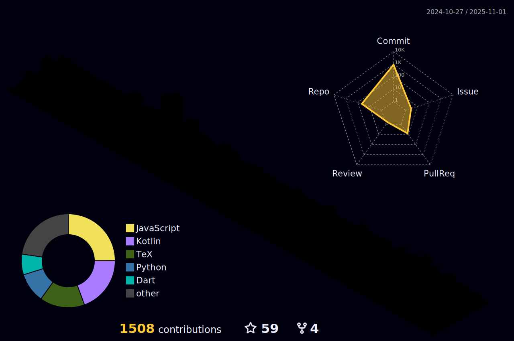

<div align="center">
  
</div>

<div align="center">

<picture>
  <!-- For dark theme -->
  <source media="(prefers-color-scheme: dark)" srcset="https://github.com/abhishek-maurya576/abhishek-maurya576/blob/main/assets/dark_theme_png.gif">
  
  <!-- For light theme -->
  <source media="(prefers-color-scheme: light)" srcset="https://github.com/abhishek-maurya576/abhishek-maurya576/blob/main/gif4%281%29.gif">
  
  <!-- Fallback image (used if neither applies) -->
  
</picture>

</div>


<div align="center">
  
</div>


<div align="center">
  
 <a href="https://komarev.com/ghpvc/?username=abhishek-maurya576">
    
  </a>
  
  
</div>

---

## 👋 Introduction 

I'm Abhishek Maurya, a passionate Python Developer and AI/ML Engineer currently pursuing a BCA at the University of Allahabad. I specialize in building intelligent systems using Python, TensorFlow, and modern AI frameworks, while also crafting mobile applications with Flutter and native Android. From developing AI-powered automation tools to creating LLM-based agents, I transform cutting-edge AI research into practical solutions. With expertise in Django, FastAPI, and mobile development, I build end-to-end applications that solve real-world problems.

---


## 🌐 Portfolio & Content Creation

<div align="center">
  <table>
    <tr>
      <td align="center" width="33%">
        <a href="https://abhishek-folio.vercel.app/">
          
        </a>
        <br/><sub>Personal Website & Projects</sub>
      </td>
      <td align="center" width="33%">
        <a href="https://youtube.com/@bforbca">
          
        </a>
        <br/><sub>Tech Content & Tutorials</sub>
      </td>
      <td align="center" width="33%">
        <a href="https://github.com/abhishek-maurya576">
          
        </a>
        <br/><sub>Code Repositories & Projects</sub>
      </td>
    </tr>
  </table>
</div>


## 🚀 What I Do 

- 🤖 **AI/ML Development** - Building intelligent systems with TensorFlow, PyTorch, and LLM integrations
- 🐍 **Python Development** - Backend APIs with Django, FastAPI, and automation scripts
- 🧬 **LLM & Generative AI** - Creating AI agents with OpenAI, Google Gemini, and Groq APIs
- 📱 **Mobile App Development** - Cross-platform apps with Flutter and native Android (Java/Kotlin)
- 🔧 **AI Automation** - Browser automation, voice assistants, and intelligent workflows
- 📂 **Version Control** with Git & GitHub for collaborative development and open source

---

<div style="background: linear-gradient(45deg, #12c2e9, #c471ed, #f64f59); padding: 20px; border-radius: 10px; margin: 20px 0;">


## 💻 Tech Stack & Tools | Python, AI & Mobile Development
<p align="center">
  
</p>

<div align="center" style="transform-style: preserve-3d; perspective: 1000px;">
  <table align="center" style="transform: rotateX(10deg); box-shadow: 0 10px 30px rgba(0,0,0,0.3); border-radius: 15px; background: rgba(255,255,255,0.1); backdrop-filter: blur(10px);">
    <tr style="transition: all 0.3s ease;">
      <td align="center" width="96" style="padding: 20px; transition: transform 0.3s ease;">
        <div style="transform-style: preserve-3d; transition: transform 0.3s ease;">
          
          <br><span style="font-weight: bold; color: #ffffff; text-shadow: 2px 2px 4px rgba(0,0,0,0.3);">Python</span>
        </div>
      </td>
      <td align="center" width="96" style="padding: 20px;">
        <div style="transform-style: preserve-3d;">
          
          <br><span style="font-weight: bold; color: #ffffff; text-shadow: 2px 2px 4px rgba(0,0,0,0.3);">TensorFlow</span>
        </div>
      </td>
      <td align="center" width="96" style="padding: 20px;">
        <div style="transform-style: preserve-3d;">
          
          <br><span style="font-weight: bold; color: #ffffff; text-shadow: 2px 2px 4px rgba(0,0,0,0.3);">Django</span>
        </div>
      </td>
      <td align="center" width="96" style="padding: 20px;">
        <div style="transform-style: preserve-3d;">
          
          <br><span style="font-weight: bold; color: #ffffff; text-shadow: 2px 2px 4px rgba(0,0,0,0.3);">Java</span>
        </div>
      </td>
      <td align="center" width="96" style="padding: 20px;">
        <div style="transform-style: preserve-3d;">
          
          <br><span style="font-weight: bold; color: #ffffff; text-shadow: 2px 2px 4px rgba(0,0,0,0.3);">GitHub</span>
        </div>
      </td>
    </tr>
  </table>
</div>

</div>

## :man_technologist: About Me 


> - 🌱 I'm currently learning **Advanced ML, LLMs, AI Agents, and Flutter**
> - 🔭 Working on **AI-powered automation tools** and intelligent mobile applications
> - 🤖 Building **LLM-based agents** using Groq, OpenAI, and Google Gemini APIs
> - 💬 Ask me about **Python, AI/ML, Django, Flutter, or LLM integration**
> - ✨ Passionate about **Intelligent Systems** and **AI-powered Mobile Apps**
> - 🧠 Focused on creating **AI solutions that enhance productivity**
> - ⚡ Fun fact: I think I am good at sleeping 😴


## 💻 Tech Stack 
| Categories      | Tools & Skills
| ----------- | ----------- | 
| 🤖 AI/ML & LLMs |      |
| 🐍 Python Stack |      |
| 📱 Mobile & Languages |     |
| ⚡ Database |     |
| 👩‍💻 IDE & Tools |      |
| ☁️ Cloud & DevOps |     |
| 📈 Version Control |   |
## 📫 How to reach me | Contact Information

[](mailto:maurya9721@gmail.com)
[](https://github.com/abhishek-maurya576)
[](https://www.linkedin.com/in/abhishekmaurya9118/)
  <div align="center">
  
</div>

## 📊 GitHub Analytics & Developer Metrics

<div align="center">
  
</div>

<div align="center">
  <table>
    <tr>
      <td width="50%">
        
      </td>
      <td width="50%">
        
      </td>
    </tr>
    <tr>
      <td width="50%">
        
      </td>
      <td width="50%">
        
      </td>
    </tr>
  </table>
</div>

### 📈 Contribution Activity Graph

<div align="center">
  
</div>


<div align="center">
<details>
 <summary><b>🏅 GSSoC (GirlScript Summer of Code) Achievements</b></summary>
 <p align="center">
   
   
   
 </p>
 <p align="center">Recognized as a <b>Code Luminary</b> and <b>Open Source Contributor</b> at GSSoC 2024 Extended 🚀</p>
</details>


</div>

<div align="center">
  <h2>🏆 GitHub Trophies</h2>
  
</div>


---

<div align="center">
  
</div>

## 🚀 Featured Projects

<p align="center">A collection of my recent work showcasing my skills in web/app development, AI, and content creation.</p>

<div align="center">
  <table>
    <tr>
      <td align="center" width="50%">
        <h3>🔍 ForensicFlow</h3>
        <p>Advanced digital forensics platform for analyzing Universal Forensic Data Reports (UFDR). Built for Smart India Hackathon 2025 with AI-powered insights using Google Gemini and OpenAI GPT.</p>
        <p>
          
          
          
          
          
        </p>
        <a href="https://forensicflow.vercel.app/">
          
        </a>
      </td>
      <td align="center" width="50%">
        <h3>📊 Student Performance Predictor</h3>
        <p>ML-powered Django application predicting student performance categories using ensemble methods (Random Forest, Decision Tree, Logistic Regression) with interactive Chart.js visualizations.</p>
        <p>
          
          
          
          
        </p>
        <a href="https://github.com/abhishek-maurya576/student-performance-predictor">
          
        </a>
      </td>
    </tr>
    <tr>
      <td align="center" width="50%">
        <h3>🧘 AuraCare - Mental Wellness App</h3>
        <p>Comprehensive mental wellness Flutter app with liquid glass-morphism UI, AI-driven mood tracking, meditation features, and community support powered by Google Gemini.</p>
        <p>
          
          
          
          
        </p>
        <a href="https://github.com/abhishek-maurya576/auracare">
          
        </a>
      </td>
      <td align="center" width="50%">
        <h3>💬 Linkzy - Real-time Chat App</h3>
        <p>Modern 1-on-1 chat application with beautiful UI and interactive animations. Features real-time messaging, profile pictures, and seamless user experience.</p>
        <p>
          
          
          
          
        </p>
        <a href="https://github.com/abhishek-maurya576/linkzy">
          
        </a>
      </td>
    </tr>
  </table>
</div>

---


## 💻 Workspace Setup
<div align="center">

```text
 IDE: VS Code, Cursor AI, PyCharm
🤖 AI Tools: GitHub Copilot, Claude, Gemini
🐍 Python: 3.11+ | Django, FastAPI
📱 Mobile: Flutter, Android Studio
🛠️ Setup: Windows 11, Dual Monitor
```

</div>

## 🔨 Currently Building

<div align="center">

| Project | Description | Status |
|---------|-------------|--------|
| 🤖 **PRIME** | Personal AI Assistant with voice control & automation | 🟢 Active |
| 🔍 **ForensicFlow** | AI-powered digital forensics platform | 🟡 Archived |

</div>

## 🎯 Philosophy
> *"Stop dreaming of perfection, take action! Launch, keep learning, and watch yourself grow."*
> — Abhishek Maurya


---
## 🤝 Let's Connect & Collaborate

<div align="center">
  <h3>🚀 Open for Exciting Opportunities</h3>
  <p>
    
    
  </p>
  
  **Looking to collaborate on:**
  - 🤖 AI/ML & LLM Integration Projects
  - 🐍 Python Backend & API Development
  - 📱 Mobile App Development (Flutter/Android)
  - 🔧 Open Source AI Tools & Automation
</div>


<div align="center">
  <h3>🏙️ My Contribution Skyline in 3D!</h3>
  
  <br/>
</div>

---

## 🐍 Contribution Snake Animation

<div align="center">
  <h3>🎯 Watch the Snake Eat My Contributions!</h3>
  <picture>
    <source media="(prefers-color-scheme: dark)" srcset="https://raw.githubusercontent.com/abhishek-maurya576/abhishek-maurya576/output/github-contribution-grid-snake-dark.svg">
    <source media="(prefers-color-scheme: light)" srcset="https://raw.githubusercontent.com/abhishek-maurya576/abhishek-maurya576/output/github-contribution-grid-snake.svg">
    
  </picture>
  <br/>
</div>


<div align="center">
  <p>
    <i>⭐ If you found my profile interesting, consider giving it a star!</i><br>
    <i>🍴 Feel free to fork this template for your own use</i>
  </p>
  
  
</div>

<div align="center">
  
</div>

<!-- Keywords: Abhishek Maurya, Python Developer, AI Engineer, Machine Learning, TensorFlow, LLM Integration, OpenAI, Django Developer, Flutter Developer, Android Developer, Mobile App Developer, BCA Student, University of Allahabad, Open Source Contributor, Groq, Gemini API -->
